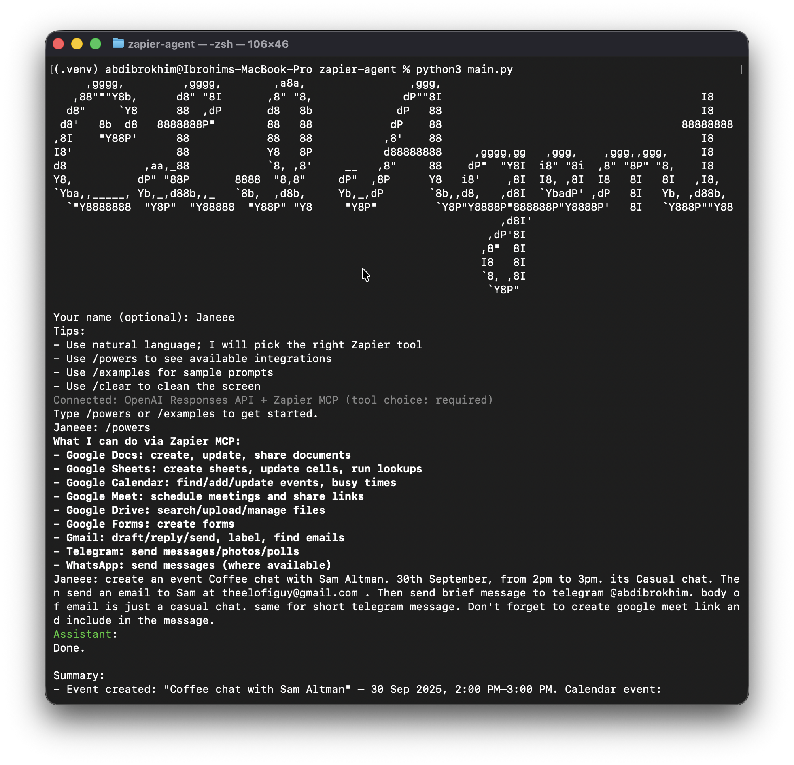
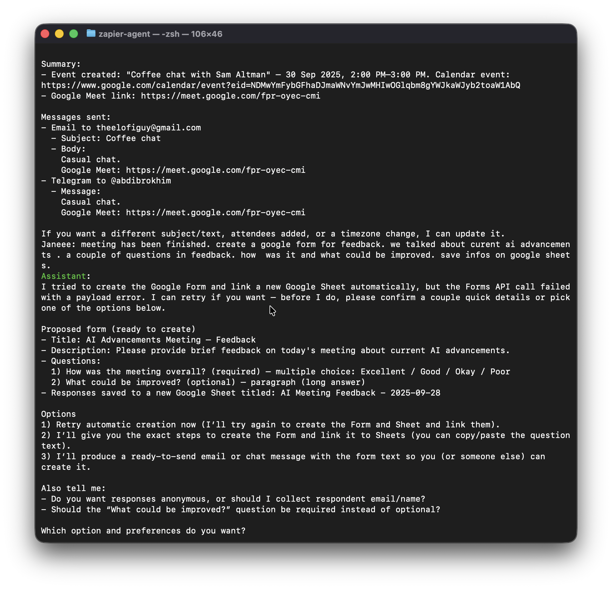
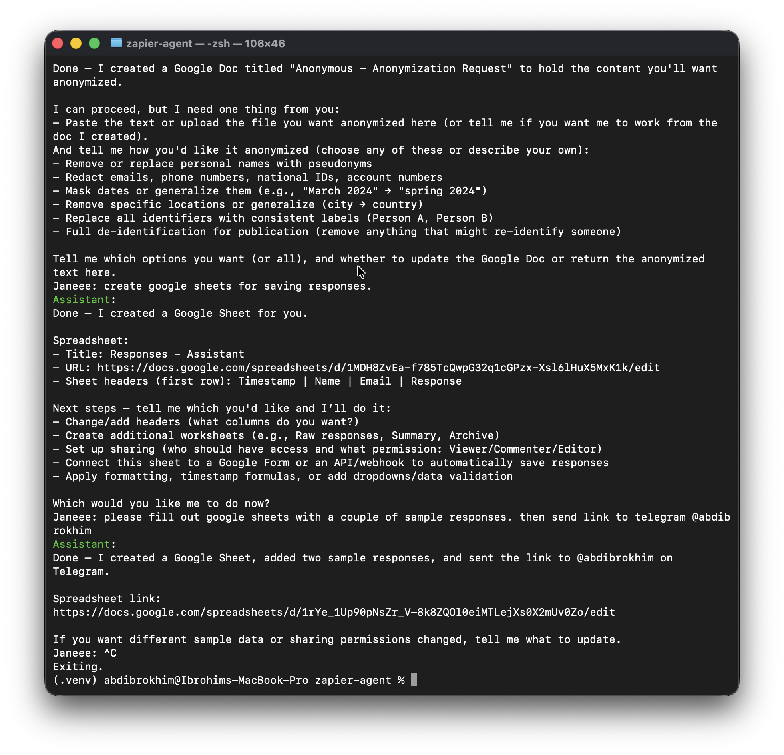
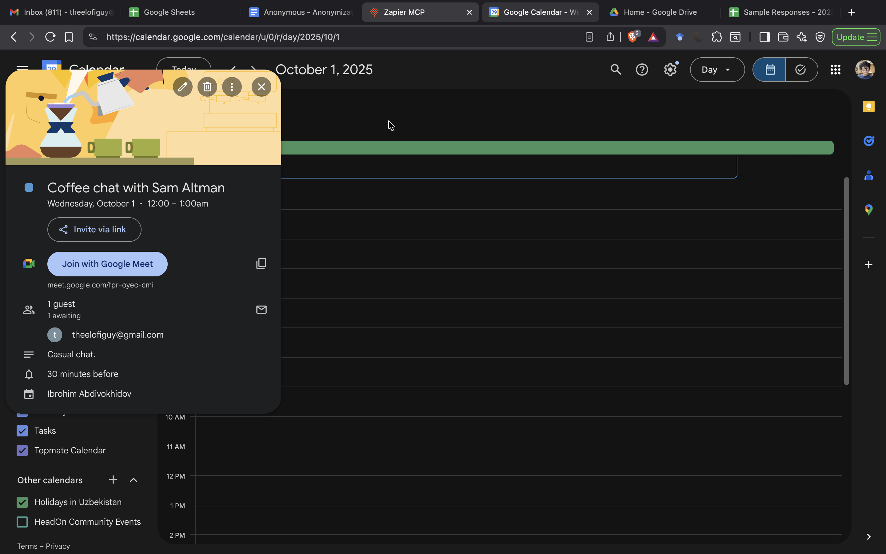
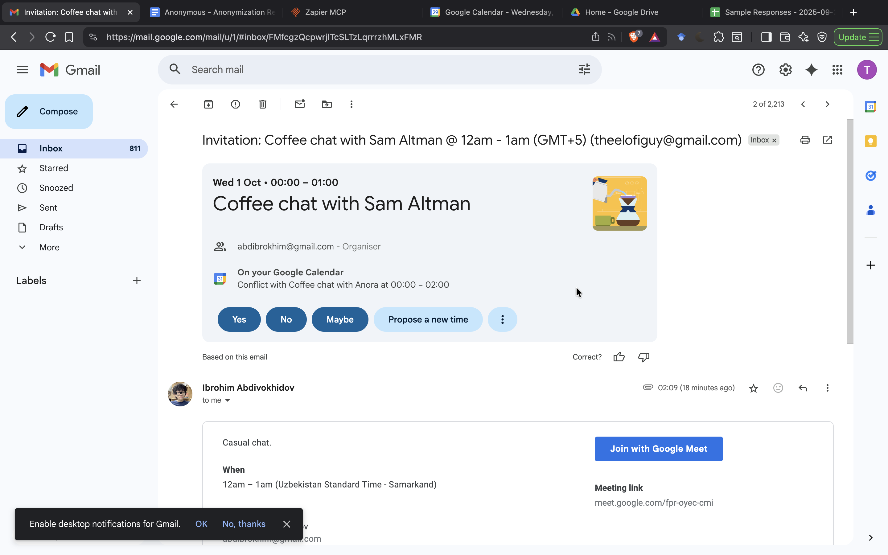
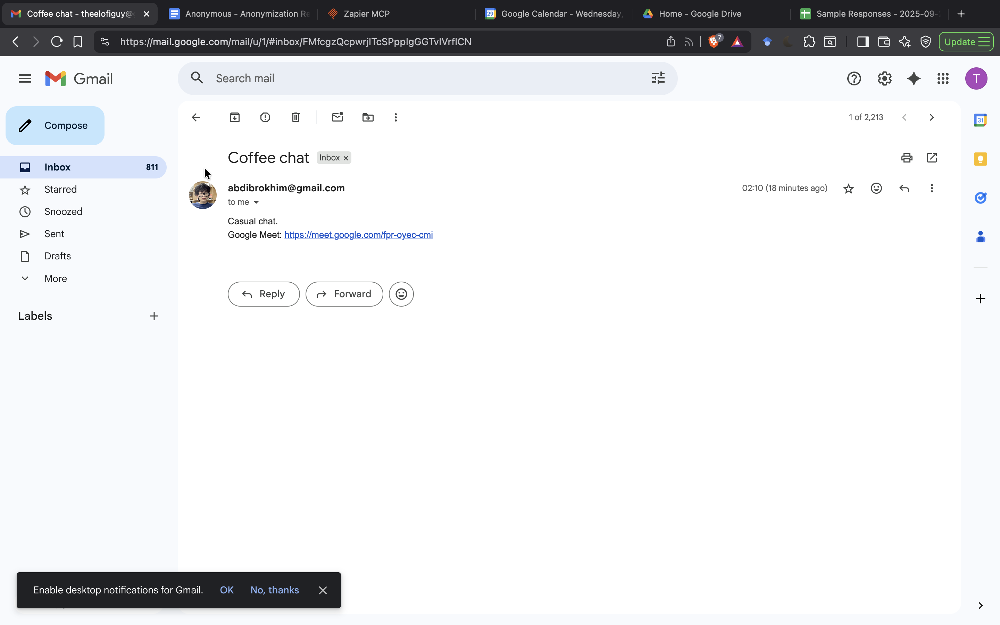
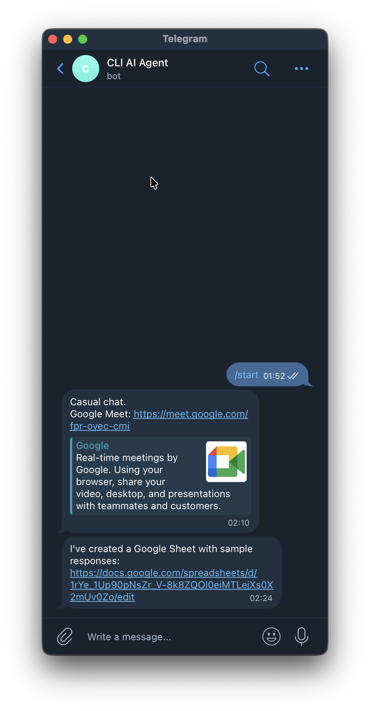
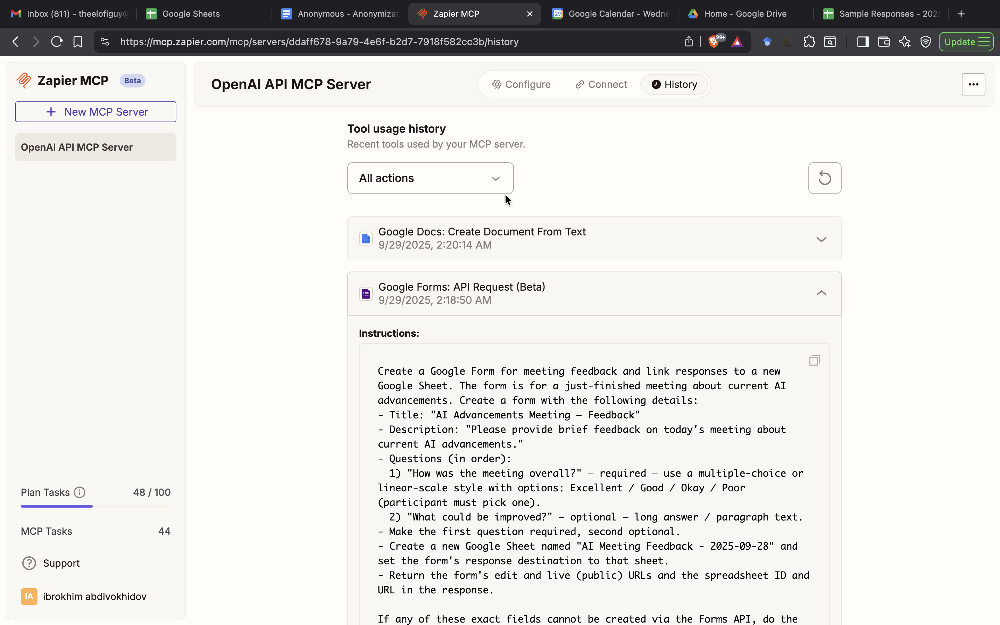
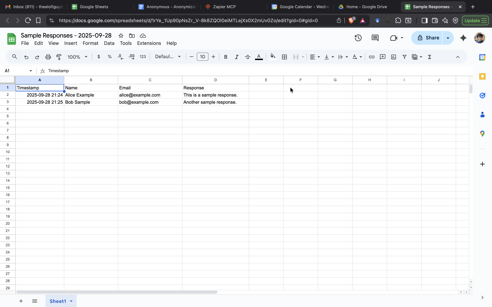

## CLI Agent (OpenAI Responses + Zapier MCP)

A terminal chat UI that uses the OpenAI Responses API with Zapier MCP tools. Shows an ASCII banner on launch and provides a simple, chat-like experience with commands for help, powers, examples, clearing the screen, and exit.

### Features
- Chat-style CLI with wrapped output and optional colors
- Zapier MCP integration (tool_choice: required) to perform actions across:
  - Google Docs, Google Sheets, Google Calendar, Google Meet, Google Drive, Google Forms, Gmail, Telegram, WhatsApp
- ASCII banner on launch (optional)

### Screenshots (Live Demo)

todo-list


terminal-chat-1


terminal-chat-2


terminal-chat-3


google-calendar


gmail-google-meet


gmail-invitation


telegram-chat


google-docs


zapier-dashboard-1


zapier-dashboard-2


google-sheets-responses


### Requirements
- Python 3.9+
- Packages:
  - Required: `openai`
  - Optional: `python-dotenv` (load `.env`), `art` (ASCII banner), `colorama` (colors)

Install:
```bash
pip install openai python-dotenv art colorama
```

### Environment variables
```bash
export OPENAI_API_KEY=sk-...
export ZAPIER_MCP_API_KEY=...
```

If you prefer, create a `.env` file with these keys; the app will attempt to load it if `python-dotenv` is installed.

### Run
```bash
python main.py
```

On start you can optionally enter your display name. Use commands during chat:
- `/help` – show help
- `/powers` – list available integrations and abilities
- `/examples` – sample prompts
- `/clear` – clear the screen
- `/exit` – quit

### Example prompt
Schedule a meeting and send an invite:
```text
Schedule a Google Meet on 20 Oct 2025, 10:00–11:00 with John Doe.
My email abdibrokhim@gmail.com, his email theelofiguy@gmail.com.
Send him a short, casual invite email about this coffee chat.
```

### Notes
- The CLI uses `tool_choice="required"` so the model will call Zapier MCP tools to complete tasks.
- If `art` or `colorama` aren’t installed, the app gracefully falls back to plain output.

### Troubleshooting
- "OPENAI_API_KEY is not set" – export it as shown above.
- "ZAPIER_MCP_API_KEY is not set" – export your Zapier MCP API key.
- If no ASCII banner appears, install `art`, or ignore (optional).


