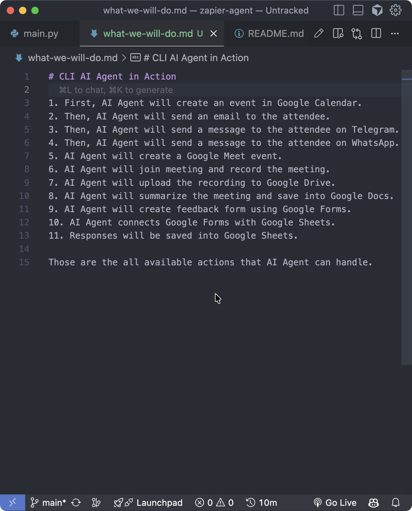
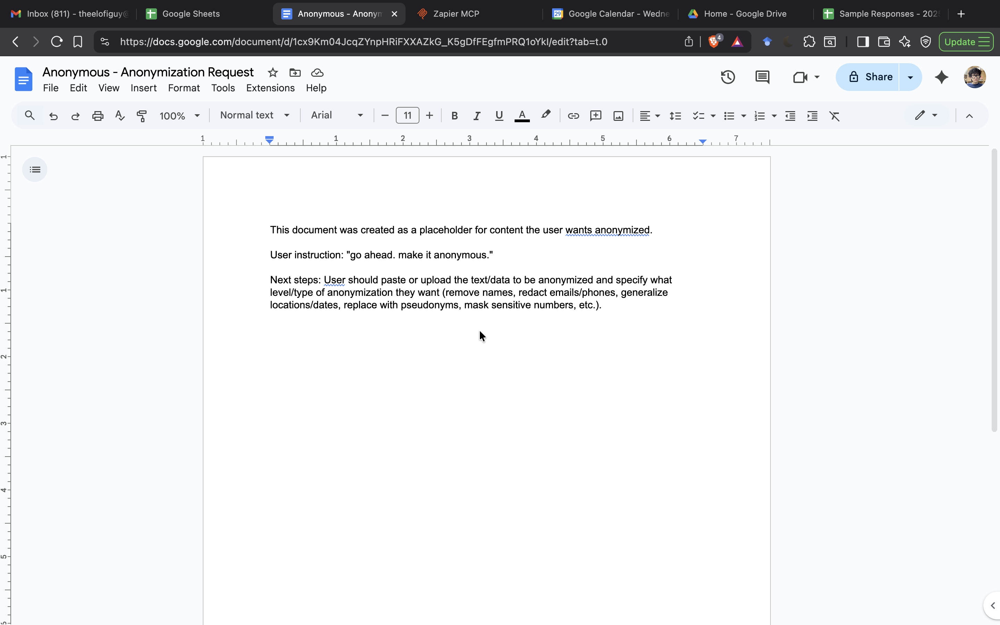
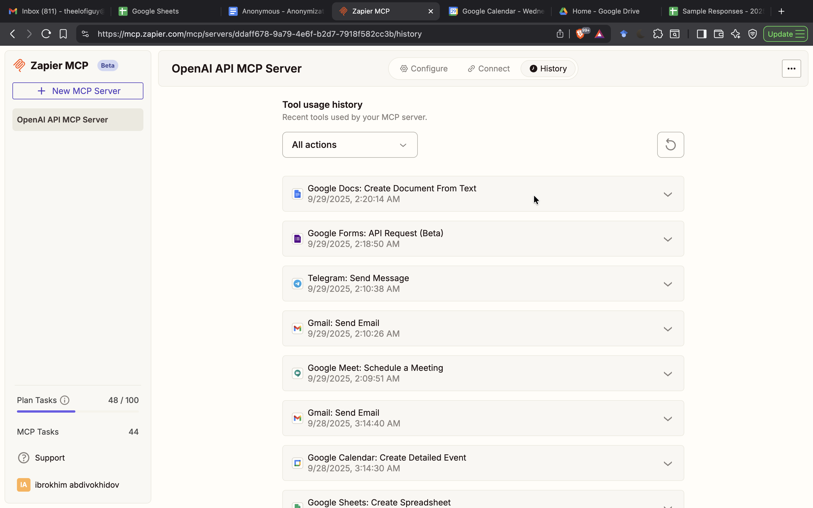

## CLI Agent (OpenAI Responses + Zapier MCP)

A terminal chat UI that uses the OpenAI Responses API with Zapier MCP tools. Shows an ASCII banner on launch and provides a simple, chat-like experience with commands for help, powers, examples, clearing the screen, and exit.

### Features
- Chat-style CLI with wrapped output and optional colors
- Zapier MCP integration (tool_choice: required) to perform actions across:
  - Google Docs, Google Sheets, Google Calendar, Google Meet, Google Drive, Google Forms, Gmail, Telegram, WhatsApp
- ASCII banner on launch (optional)

### Screenshots (Live Demo)

todo-list


terminal-chat-1


terminal-chat-2


terminal-chat-3


google-calendar


gmail-google-meet


gmail-invitation


telegram-chat


google-docs


zapier-dashboard-1


zapier-dashboard-2


google-sheets-responses


### Step-by-step tutorial

1) Check prerequisites
- Python 3.9+ installed
- Two API keys available: `OPENAI_API_KEY` and `ZAPIER_MCP_API_KEY`

2) (Optional) Create and activate a virtual environment
```bash
python3 -m venv .venv
source .venv/bin/activate
```

3) Install dependencies
```bash
pip install openai python-dotenv art colorama
```

4) Configure environment variables
- Option A (macOS/Linux):
```bash
export OPENAI_API_KEY=sk-...
export ZAPIER_MCP_API_KEY=...
```
- Option B (.env file in project root; auto-loaded if `python-dotenv` is installed):
```bash
OPENAI_API_KEY=sk-...
ZAPIER_MCP_API_KEY=...
```

5) Ensure your Zapier MCP account has access to the apps you plan to use
- At minimum, connect Gmail and Google Calendar for the meeting demo
- Optionally connect Google Docs, Sheets, Drive, Forms, Telegram, WhatsApp

6) Run the CLI
```bash
python main.py
```
- When prompted, optionally enter your display name
- Useful commands: `/help`, `/powers`, `/examples`, `/clear`, `/exit`

7) Try a quick workflow
- Schedule a meeting and email the attendee:
```text
Schedule a Google Meet on 20 Oct 2025, 10:00–11:00 with John Doe.
My email abdibrokhim@gmail.com, his email theelofiguy@gmail.com.
Send him a short, casual invite email about this coffee chat.
```
- Create a project brief in Docs:
```text
Create a Google Doc titled “Project Zap” with sections: Overview, Goals, Timeline, Risks.
Share with ops@acme.com.
```
- Start a budget in Sheets:
```text
Create a budget Google Sheet with columns: Item, Cost, Owner. Add three sample rows.
```

8) Tips
- The CLI uses `tool_choice="required"` so the model will actually call Zapier MCP tools
- If `art` or `colorama` aren’t installed, the app falls back to plain output
- You can paste transcripts/notes after a meeting and ask: “Summarize and save to Google Docs”

9) Troubleshooting
- See the Troubleshooting section below for common issues

### Requirements
- Python 3.9+
- Packages:
  - Required: `openai`
  - Optional: `python-dotenv` (load `.env`), `art` (ASCII banner), `colorama` (colors)

Install:
```bash
pip install openai python-dotenv art colorama
```

### Environment variables
```bash
export OPENAI_API_KEY=sk-...
export ZAPIER_MCP_API_KEY=...
```

If you prefer, create a `.env` file with these keys; the app will attempt to load it if `python-dotenv` is installed.

### Run
```bash
python main.py
```

On start you can optionally enter your display name. Use commands during chat:
- `/help` – show help
- `/powers` – list available integrations and abilities
- `/examples` – sample prompts
- `/clear` – clear the screen
- `/exit` – quit

### Example prompt
Schedule a meeting and send an invite:
```text
Schedule a Google Meet on 20 Oct 2025, 10:00–11:00 with John Doe.
My email abdibrokhim@gmail.com, his email theelofiguy@gmail.com.
Send him a short, casual invite email about this coffee chat.
```

### Notes
- The CLI uses `tool_choice="required"` so the model will call Zapier MCP tools to complete tasks.
- If `art` or `colorama` aren’t installed, the app gracefully falls back to plain output.

### Troubleshooting
- "OPENAI_API_KEY is not set" – export it as shown above.
- "ZAPIER_MCP_API_KEY is not set" – export your Zapier MCP API key.
- If no ASCII banner appears, install `art`, or ignore (optional).


